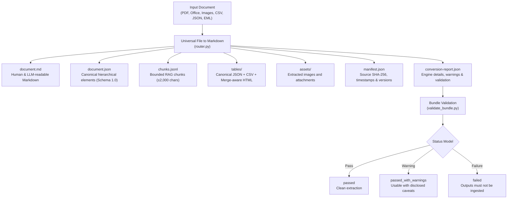

# Universal File to Markdown

[](https://verified-skill.com/skills/smartyjohnway/universal-file-to-markdown/universal-file-to-markdown)
[](https://github.com/SmartyJohnway/universal-file-to-markdown/releases/latest)
[](https://github.com/SmartyJohnway/universal-file-to-markdown/actions/workflows/test.yml)
[](LICENSE)
[](requirements.txt)

[繁體中文](README.zh-TW.md) · [Changelog](CHANGELOG.md) · [Releases](https://github.com/SmartyJohnway/universal-file-to-markdown/releases)

Convert PDF, scanned documents, DOCX, XLSX/XLSM, PPTX, CSV/TSV, JSON, EML and Pandoc markup into Markdown plus validated, traceable bundles for AI agents, RAG, and downstream automation.

> **Not just Markdown. Know whether the conversion can be trusted.**

*Local-first · Validation-backed · Source-traceable · Failure-aware*

---

## Quick Start

### 1. Install as an Agent Skill

Universal File to Markdown is published and source-verified on **vSkill**:

```bash
npx vskill@latest install smartyjohnway/universal-file-to-markdown/universal-file-to-markdown
```

- [View on vSkill](https://verified-skill.com/skills/smartyjohnway/universal-file-to-markdown/universal-file-to-markdown)
- [View Live Verification & Security Report](https://verified-skill.com/skills/smartyjohnway/universal-file-to-markdown/universal-file-to-markdown/security)

### 2. Run Locally

Requires Python 3.10–3.12 (primary qualified runtime: Python 3.11).

```bash
git clone https://github.com/SmartyJohnway/universal-file-to-markdown.git
cd universal-file-to-markdown

python -m venv .venv
source .venv/bin/activate    # Windows PowerShell: .venv\Scripts\Activate.ps1

python -m pip install -r requirements.txt
python scripts/capability_probe.py --json

# Convert a file
python scripts/router.py path/to/document.pdf --output ./output_bundle

# Validate bundle integrity
python scripts/validate_bundle.py ./output_bundle
```

---

## Why Universal File to Markdown?

Most document converters generate a standalone `.md` file and stop there. If tables collapse, OCR misrecognizes text, or character encodings produce mojibake, consumers have no automated way to know.

Universal File to Markdown approaches document conversion as an **auditable, evidence-first pipeline**:

| What you need | Standard Markdown Converter | Universal File to Markdown |
|---|---|---|
| **Primary Output** | Plain `document.md` | `document.md` plus schema-validated canonical bundle |
| **Trust & Confidence** | Assumed success unless process crashes | `conversion-report.json` with explicit `passed` / `passed_with_warnings` / `failed` status |
| **Source Provenance** | None | Bounding boxes, page numbers, sheet names, slide numbers, and shape locators |
| **RAG & Agent Ingestion** | Ad-hoc text splitting | Bounded RAG chunks (≤2,000 chars) with hierarchical context and ancestor IDs |
| **Complex Tables** | Merged cells flattened or corrupted | Preserves merge geometry with HTML `rowspan`/`colspan` plus CSV assets |
| **Failure Disclosure** | Silent loss or garbage text | Explicit warnings, ambiguity candidates, and unextracted structure disclosures |

---

## Failure-aware by Design

The project never treats `document.md` alone as proof of conversion success. When content is ambiguous or unsupported, the system discloses uncertainty explicitly:

| Condition | Converter Behavior |
|---|---|
| **Ambiguous text encoding** | Discloses all plausible candidates and scores (e.g. Big5 vs CP950); annotates Markdown and warns downstream consumers. |
| **Low OCR confidence** | Preserves OCR tokens and regions, recording confidence scores and warning codes rather than claiming clean extraction. |
| **Scanned table uncertainty** | Requires geometric and token evidence; rejected table candidates remain readable text with warnings instead of false table structures. |
| **Unsupported structures** | Discloses unparsed SmartArt, embedded OLE objects, or chart series rather than silently dropping them. |
| **Bundle validation failure** | Flags the conversion as `failed`; canonical and RAG artifacts must not be accepted as valid results. |
| **Rerun failure safety** | Clears known previous artifacts before rerun, preventing stale outputs from masking an extraction failure. |

> [!NOTE]
> *Validation-backed* means structural integrity, schema compliance, and cross-reference consistency are strictly verified. It does not claim 100% semantic omniscience across all unstructured inputs.

---

## Supported Formats

| Input | Primary Engine | Canonical Granularity | Key Behaviors |
|---|---|---|---|
| **DOCX** | python-docx + OOXML | heading, paragraph, list item, table | Formatting, links, notes, headers/footers, merged cells |
| **XLSX / XLSM** | openpyxl | sheet, blank-separated block, table, chart/image ref | Formulas, comments, merged cells, hidden-state metadata |
| **PPTX** | python-pptx + OOXML | slide, group, title, paragraph, list, table, chart, image, note | Role/column reading plan, bullet inheritance, SmartArt/OLE disclosure |
| **Digital PDF** | PyMuPDF + pdfplumber | page, located text block, table | Line-aware XY-cut order, bbox table insertion, text deduplication |
| **Scanned PDF** | RapidOCR (offline); Tesseract fallback | page, OCR region, table | OCR confidence and table-likelihood reporting |
| **PNG / JPEG / TIFF / BMP / WebP** | RapidOCR (offline); Tesseract fallback | OCR region, table | Direct offline image OCR |
| **CSV / TSV** | Python stdlib CSV | canonical table | Encoding scoring with Traditional Chinese Big5/CP950 support |
| **JSON** | Python stdlib JSON | structured block | Pretty-printed Unicode JSON |
| **EML** | Python stdlib email | email, attachment | Sanitized collision-safe attachment names |
| **HTML / EPUB / RST / Org / TeX** | Pandoc (optional) | structured block | Explicit failure when Pandoc is unavailable |

*Legacy `.doc`, `.xls`, and `.ppt` binary files are not parsed directly. Convert them to modern OOXML formats first.*

---

## What You Get: Output Bundle

Each conversion writes a self-contained, schema-validated directory:



```text
output_dir/
  document.md              Human- and LLM-readable Markdown
  document.json            Canonical hierarchical elements, schema 1.0
  chunks.jsonl              Locator-rich RAG chunks, max 2,000 characters
  tables/                   Canonical JSON plus CSV and merge-aware HTML
  assets/                   Extracted images and attachments
  manifest.json             Source SHA-256, versions, timestamp, final status
  conversion-report.json   Engine details, warnings, and bundle validation
```

---

## Reading the Result: Status Model

Always inspect `conversion-report.json` before feeding outputs to downstream LLM or RAG systems:

| Status | Meaning | Action |
|---|---|---|
| **`passed`** | Bundle validation succeeded; schemas, locators, and tables are consistent with no detected loss. | Safe for automated ingestion. |
| **`passed_with_warnings`** | Output is usable, but one or more uncertainties (e.g. ambiguous encoding, OCR confidence, unparsed SmartArt) were disclosed. | Ingest with awareness of logged warnings. |
| **`failed`** | Extraction or validation failed. Known generated outputs are invalidated. | **Do not ingest** canonical or chunk outputs. |

A successful bundle includes:

```json
{
  "status": "passed",
  "bundle_validation": {
    "status": "passed"
  }
}
```

---

## Public Examples

Explore verified showcases in the [`examples/`](https://github.com/SmartyJohnway/universal-file-to-markdown/tree/main/examples) directory:

- [**Showcase 1: Normal Success (DOCX)**](https://github.com/SmartyJohnway/universal-file-to-markdown/tree/main/examples#showcase-1-normal-success-docx) — Full fidelity text and paragraph styling with canonical element hierarchy and bounded chunks.
- [**Showcase 2: Warning & Uncertainty (CSV Big5)**](https://github.com/SmartyJohnway/universal-file-to-markdown/tree/main/examples#showcase-2-warning--uncertainty-disclosure-csv-with-big5-encoding) — Multi-candidate encoding scoring and explicit disclosure of ambiguous legacy encodings.
- [**Showcase 3: Structural Fidelity (XLSX Merged Cells)**](https://github.com/SmartyJohnway/universal-file-to-markdown/tree/main/examples#showcase-3-structural-fidelity-xlsx-merged-cells) — Preservation of merged table geometry with `colspan`/`rowspan` HTML representations and CSV grid assets.

---

## Known Boundaries

- **Scanned tables:** Reconstruction uses geometric heuristics; complex borderless or heavily merged scanned tables may require human review or specialized heavy models.
- **SmartArt & OLE:** Embedded shapes and OLE objects are detected, located, and disclosed, but not expanded into vector trees.
- **Charts:** Office charts are preserved as canonical references; plotted data series are not rendered in this release.
- **PDF & PPTX reading order:** Uses deterministic geometric and placeholder-aware reading plans. Ambiguous visual layouts carry warnings for downstream inspection.
- **DOCX edge cases:** Tracked revisions, deeply nested tables, and exact inline-image anchoring remain constrained.
- **Legacy binary formats:** Binary `.doc`, `.xls`, `.ppt` files must be converted to modern OOXML formats before running.

---

## Installation & Advanced Usage

### Runtime Environment

- **Python:** 3.10–3.12 (qualified on 3.11). Python 3.13 is not supported.
- **Offline OCR:** Bundles RapidOCR (`rapidocr-onnxruntime>=1.4,<2`, qualified on `1.4.4`). Runs offline with no PyTorch runtime or external model downloads.
- **Linux:** `libGL.so.1` may be required for OpenCV/RapidOCR.
- **Windows:** Microsoft Visual C++ runtime may be required for OpenCV.
- **Optional Tools:**
  - `tesseract`: Fallback Latin-script OCR.
  - `pandoc`: Required only for optional markup formats (HTML, EPUB, RST, Org, TeX).

### CLI Usage

```bash
# Basic conversion
python scripts/router.py INPUT_FILE --output OUTPUT_DIRECTORY

# Specify explicit encoding for ambiguous text
python scripts/router.py input.csv --output output_dir --encoding gb18030

# Standalone bundle validation
python scripts/validate_bundle.py OUTPUT_DIRECTORY

# Evaluate downstream chunk context score
python scripts/score_chunk_context.py OUTPUT_DIRECTORY [OUTPUT_DIRECTORY ...]
```

---

## Documentation

### Using the Tool
- [AI Skill Operating Contract](SKILL.md)
- [Format Capability Matrix](references/capability_matrix.md)
- [Engine Notes and Escalation Guidance](references/engine_notes.md)
- [Examples Guide](https://github.com/SmartyJohnway/universal-file-to-markdown/tree/main/examples)

### Architecture & Contracts
- Current stable release: `1.8.2`
- [Chunk Consumer Contract](references/chunk_consumer_contract.md)
- [Layout & Association Contract](references/layout_association_contract.md)
- Canonical JSON Schemas (schemas/)
- [Versioning Specification](VERSIONING.md)

### Quality & Governance
- [Contributing Guide](CONTRIBUTING.md)
- [Security Policy](SECURITY.md)
- [Support Policy](SUPPORT.md)
- [Project Governance](GOVERNANCE.md)
- [Release Process](RELEASING.md)
- [Licensing Guide](docs/LICENSING.md)

---

## Development and Release Checks

Run verification gates locally:

```bash
python scripts/capability_probe.py --json
python scripts/check_release_consistency.py
python scripts/check_markdown_links.py
python scripts/build_skill_package.py --profile release --output dist --verify
python scripts/build_skill_package.py --profile agent-skill --output dist --verify
python scripts/validate_skill_package.py --profile release dist/universal-file-to-markdown-1.8.2-release.zip
python scripts/validate_skill_package.py --profile agent-skill dist/universal-file-to-markdown-1.8.2-skill.zip
python -m pytest tests/ -q
python -m compileall -q scripts tests
```

---

## License

Licensed under the [Apache License 2.0](LICENSE). Commercial use, modification, and redistribution are permitted under its terms, including contributor patent grants. See `THIRD_PARTY_NOTICES.md` and `LICENSES.md` for third-party notices.
