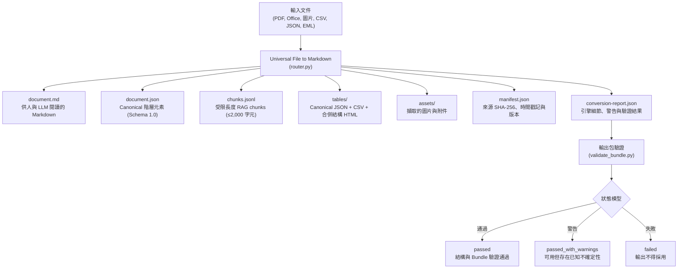

# Universal File to Markdown

[](https://verified-skill.com/skills/smartyjohnway/universal-file-to-markdown/universal-file-to-markdown)
[](https://github.com/SmartyJohnway/universal-file-to-markdown/releases/latest)
[](https://github.com/SmartyJohnway/universal-file-to-markdown/actions/workflows/test.yml)
[](LICENSE)
[](requirements.txt)

[English](README.md) · [變更紀錄](CHANGELOG.zh-TW.md) · [Releases](https://github.com/SmartyJohnway/universal-file-to-markdown/releases)

這是一套以原文正確性、內容完整性、來源可追溯與 AI 可接手性為優先的文件擷取技能，可將 PDF、掃描文件、DOCX、XLSX/XLSM、PPTX、CSV/TSV、JSON、EML 與 Pandoc markup 格式轉換為 Markdown，以及供 AI Agent、RAG 與自動化工作流程使用的 schema 驗證輸出包。

> **Not just Markdown. Know whether the conversion can be trusted.**  
> 不只是轉出 Markdown，更能清楚掌握轉換是否值得信賴。

*Local-first · 驗證把關 · 來源可追溯 · 明確揭露不確定性*

---

## 快速開始 (Quick Start)

### 1. 安裝為 Agent Skill

本專案已在 **vSkill** 平台發布並通過 source-verified 驗證：

```bash
npx vskill@latest install smartyjohnway/universal-file-to-markdown/universal-file-to-markdown
```

- [在 vSkill 上查看](https://verified-skill.com/skills/smartyjohnway/universal-file-to-markdown/universal-file-to-markdown)
- [查看即時驗證與安全性報告](https://verified-skill.com/skills/smartyjohnway/universal-file-to-markdown/universal-file-to-markdown/security)

### 2. 本地端執行 (Run Locally)

需要 Python 3.10–3.12 環境（主要合格驗證版本為 Python 3.11）。

```bash
git clone https://github.com/SmartyJohnway/universal-file-to-markdown.git
cd universal-file-to-markdown

python -m venv .venv
source .venv/bin/activate    # Windows PowerShell: .venv\Scripts\Activate.ps1

python -m pip install -r requirements.txt
python scripts/capability_probe.py --json

# 執行檔案轉換
python scripts/router.py path/to/document.pdf --output ./output_bundle

# 驗證輸出包完整性
python scripts/validate_bundle.py ./output_bundle
```

---

## 為什麼選擇本專案？(Why This Project?)

當文件轉換用於 RAG、AI Agent 讀取或自動化流程時，單純輸出 Markdown 無法直接反映轉換產物是否值得信賴。

Universal File to Markdown 將文件轉換視為**具備稽核證據的工程流程**：

| 能力項目 | Universal File to Markdown 提供的具體能力 |
|---|---|
| **主要輸出** | `document.md` 外加通過 Schema 驗證的 canonical bundle（`document.json`、`chunks.jsonl`、`tables/`、`manifest.json`） |
| **品質與信心度** | 明確的 `conversion-report.json`，提供 `passed` / `passed_with_warnings` / `failed` 與 bundle 驗證結果 |
| **來源回溯** | 在可取得時提供 bounding box、頁碼、工作表、投影片與 shape 定位 |
| **RAG 與 AI 接手** | 上限 2,000 字元的受限 chunks，附帶階層脈絡與 ancestor ID |
| **合併表格** | 保留結構幾何，產出具備 `rowspan`/`colspan` 的 HTML 表格、canonical JSON 與 CSV 資產 |
| **不確定性揭露** | 明確發出 warning，揭露候選編碼評分與未解析結構 |

---

## 具備失敗感知架構 (Failure-aware by Design)

本專案不會把單純產生 `document.md` 視為成功的證據。當遇到不確定或不支援的內容時，系統會明確揭露：

| 狀況 | 轉換器處理方式 |
|---|---|
| **文字編碼有歧義** | 提供候選編碼評分（例如 Big5 vs CP950），在 Markdown 頂部標註並發出警告。 |
| **OCR 信心度不足** | 保留 OCR 文字與區域，同時記錄信心分數與 warning 程式碼，不假裝完美辨識。 |
| **掃描表格證據不足** | 必須同時具備幾何線段與文字標記證據；若不充分則保留為純文字並標註警告，避免產出錯誤表格結構。 |
| **不支援的複合結構** | 明確揭露未展開的 SmartArt、內嵌 OLE 物件或圖表資料序列，不默默吞掉內容。 |
| **Bundle 驗證未通過** | 標記為 `failed`；canonical 與 RAG chunks 不得被視為有效結果。 |
| **重新執行失敗防護** | 重新轉換前會先清理已知的既有產物，避免先前成功的舊檔案在本次失敗時造成誤判。 |

> [!NOTE]
> *Validation-backed*（驗證把關）代表嚴格檢查結構完整性、schema 一致性與相互參照。這並不代表對所有非結構化文字具備 100% 語意全知能力。

---

## 支援格式 (Supported Formats)

| 輸入格式 | 主要解析引擎 | Canonical 元素粒度 | 重要處理行為 |
|---|---|---|---|
| **DOCX** | python-docx + OOXML | heading, paragraph, list item, table | 粗斜體、超連結、註解、頁首頁尾、合併儲存格 |
| **XLSX / XLSM** | openpyxl | sheet, 空白分隔 block, table, 圖表/圖片參照 | 公式、註解、合併儲存格、隱藏狀態 metadata |
| **PPTX** | python-pptx + OOXML | slide, group, title, paragraph, list, table, 圖片, 備忘稿 | role/column 閱讀計畫、清單符號繼承、SmartArt/OLE 揭露 |
| **數位 PDF** | PyMuPDF + pdfplumber | page, 定位文字 block, table | 行級 XY-cut 排序、bbox 表格插入、文字去重 |
| **掃描 PDF** | RapidOCR（離線）；Tesseract fallback | page, OCR 區域, table | OCR 信心度評估與表格可能性分析 |
| **PNG / JPEG / TIFF / BMP / WebP** | RapidOCR（離線）；Tesseract fallback | OCR 區域, table | 原生離線圖片 OCR |
| **CSV / TSV** | Python stdlib CSV | canonical table | 提供 Big5/CP950 候選評分與編碼歧義揭露 |
| **JSON** | Python stdlib JSON | structured block | 美化縮排與 Unicode 格式化 |
| **EML** | Python stdlib email | email, 附件 | 檔名清理與避免附件名稱衝突 |
| **HTML / EPUB / RST / Org / TeX** | Pandoc（選用） | structured block | 未安裝 Pandoc 時明確報錯，不假裝支援 |

*舊式 `.doc`、`.xls`、`.ppt` 等二進位格式不直接支援，請先轉為 OOXML 現代格式。*

---

## 輸出包架構 (What You Get)

每次轉換會產生自包含且通過 Schema 驗證的輸出資料夾：



```text
output_dir/
  document.md              供人與 LLM 閱讀的 Markdown
  document.json            Canonical 階層元素，schema 1.0
  chunks.jsonl              含定位資訊的 RAG chunks，最長 2,000 字元
  tables/                   Canonical JSON、CSV 與保留合併結構的 HTML
  assets/                   擷取的圖片與附件
  manifest.json             來源 SHA-256、版本、時間與最終狀態
  conversion-report.json   引擎細節、警告與 bundle 驗證結果
```

---

## 如何判讀結果：狀態模型 (Status Model)

將產物交付給下游 LLM 或 RAG 系統前，務必先檢查 `conversion-report.json`：

| 狀態碼 | 意義 | 建議處置 |
|---|---|---|
| **`passed`** | Bundle 驗證成功，schema、定位與表格皆一致且未發現遺失。 | 可進入後續處理流程；是否需要人工覆核仍依使用情境與下游政策決定。 |
| **`passed_with_warnings`** | 輸出可以使用，但包含明確揭露的不確定性（如編碼歧義、OCR 信心度不足或未解析的 SmartArt）。 | 接受輸出並納入警告紀錄評估。 |
| **`failed`** | 轉換或驗證失敗。已生成的產物已被標記為無效。 | **不得採用** canonical 或 chunk 產物。 |

驗證通過的輸出包報告包含：

```json
{
  "status": "passed",
  "bundle_validation": {
    "status": "passed"
  }
}
```

---

## 公開範例展示 (Public Examples)

在 [`examples/`](https://github.com/SmartyJohnway/universal-file-to-markdown/tree/main/examples) 目錄中可找到經實際驗證的範例：

- [**範例 1: 正常轉換 (DOCX)**](https://github.com/SmartyJohnway/universal-file-to-markdown/tree/main/examples#showcase-1-normal-success-docx) — 保留粗體與斜體文字樣式，產出對應的 canonical 階層與 bounded chunks。
- [**範例 2: 警告與不確定性揭露 (CSV Big5)**](https://github.com/SmartyJohnway/universal-file-to-markdown/tree/main/examples#showcase-2-warning--uncertainty-disclosure-csv-with-big5-encoding) — 多重候選編碼評分，明確揭露舊式編碼歧義而非硬猜。
- [**範例 3: 結構保真度 (XLSX 合併儲存格)**](https://github.com/SmartyJohnway/universal-file-to-markdown/tree/main/examples#showcase-3-structural-fidelity-xlsx-merged-cells) — 保留合併儲存格結構，生成具備 `colspan`/`rowspan` 的 HTML 表格與對應 CSV/JSON 資產。

---

## 已知邊界 (Known Boundaries)

- **掃描表格：** 採用幾何 heuristics 重建；複雜無框線或重度合併的表格可能需要人工檢查或專業重型模型。
- **SmartArt 與 OLE：** 會定位並揭露，但不會展開為向量物件樹。
- **圖表：** Office 圖表保留為 canonical reference，本版本不會渲染圖表資料序列。
- **PDF 與 PPTX 閱讀順序：** 採用 deterministic 幾何與預留位置排序計畫。若視覺排版仍具歧義會附帶 warning。
- **DOCX 邊界：** 追蹤修訂（tracked revisions）、深層巢狀表格與精準行內圖片錨定仍受限。
- **舊式二進位格式：** `.doc`、`.xls`、`.ppt` 必須先轉換為 OOXML 現代格式後再行處理。

---

## 安裝與進階使用 (Installation & Details)

### 執行環境

- **Python：** 3.10–3.12（官方驗證基準：3.11）。不支援 Python 3.13。
- **離線 OCR：** 內建 RapidOCR (`rapidocr-onnxruntime>=1.4,<2`，驗證版本 `1.4.4`)。完全離線運作，不需 PyTorch 亦不需連網下載模型。
- **Linux：** OpenCV/RapidOCR 可能需要 `libGL.so.1`。
- **Windows：** OpenCV 可能需要 Microsoft Visual C++ runtime。
- **選用工具：**
  - `tesseract`：作為 Latin-script OCR 的 fallback 選項。
  - `pandoc`：僅在處理非核心 markup 格式（HTML、EPUB、RST、Org、TeX）時需要。

### 命令列指令

```bash
# 基本轉換指令
python scripts/router.py INPUT_FILE --output OUTPUT_DIRECTORY

# 針對歧義文字指定明確編碼
python scripts/router.py input.csv --output output_dir --encoding gb18030

# 獨立執行輸出包驗證
python scripts/validate_bundle.py OUTPUT_DIRECTORY

# 計算 downstream chunk context 分數
python scripts/score_chunk_context.py OUTPUT_DIRECTORY [OUTPUT_DIRECTORY ...]
```

---

## 文件索引 (Documentation)

### 使用指南
- [AI 技能操作合約 (SKILL.md)](SKILL.md)
- [格式能力矩陣 (Capability Matrix)](references/capability_matrix.md)
- [解析引擎說明與升級指引 (Engine Notes)](references/engine_notes.md)
- [公開範例導覽 (Examples Guide)](https://github.com/SmartyJohnway/universal-file-to-markdown/tree/main/examples)

### 架構與合約
- 目前 stable release：`1.8.2`
- [Chunk 介接合約 (Chunk Consumer Contract)](references/chunk_consumer_contract.md)
- [排版與關聯分析合約 (Layout Contract)](references/layout_association_contract.md)
- Canonical JSON Schemas (schemas/)
- [版本規格說明 (Versioning Specification)](VERSIONING.md)

### 專案品質與治理
- [貢獻指南 (CONTRIBUTING.md)](CONTRIBUTING.md)
- [安全政策 (SECURITY.md)](SECURITY.md)
- [支援政策 (SUPPORT.md)](SUPPORT.md)
- [治理規範 (GOVERNANCE.md)](GOVERNANCE.md)
- [發布流程 (RELEASING.md)](RELEASING.md)
- [授權指南 (docs/LICENSING.md)](docs/LICENSING.md)

---

## 開發與發布檢查 (Development Checks)

可在本地端執行下列驗證檢查：

```bash
python scripts/capability_probe.py --json
python scripts/check_release_consistency.py
python scripts/check_markdown_links.py
python scripts/build_skill_package.py --profile release --output dist --verify
python scripts/build_skill_package.py --profile agent-skill --output dist --verify
python scripts/validate_skill_package.py --profile release dist/universal-file-to-markdown-1.8.2-release.zip
python scripts/validate_skill_package.py --profile agent-skill dist/universal-file-to-markdown-1.8.2-skill.zip
python -m pytest tests/ -q
python -m compileall -q scripts tests
```

---

## 專案授權 (License)

本專案採用 [Apache License 2.0](LICENSE)。在遵守授權條款的前提下，允許商業使用、修改與再散布，並包含明確的貢獻者專利授權條款。第三方相依套件適用其各自授權，請參閱 `THIRD_PARTY_NOTICES.md` 與 `LICENSES.md`。
